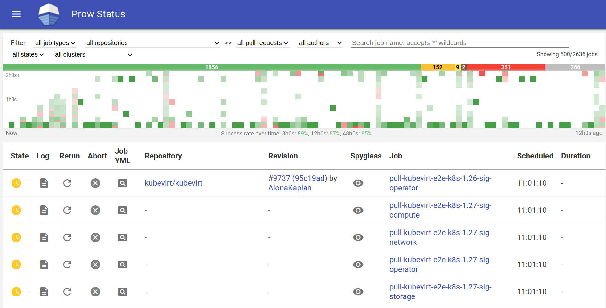
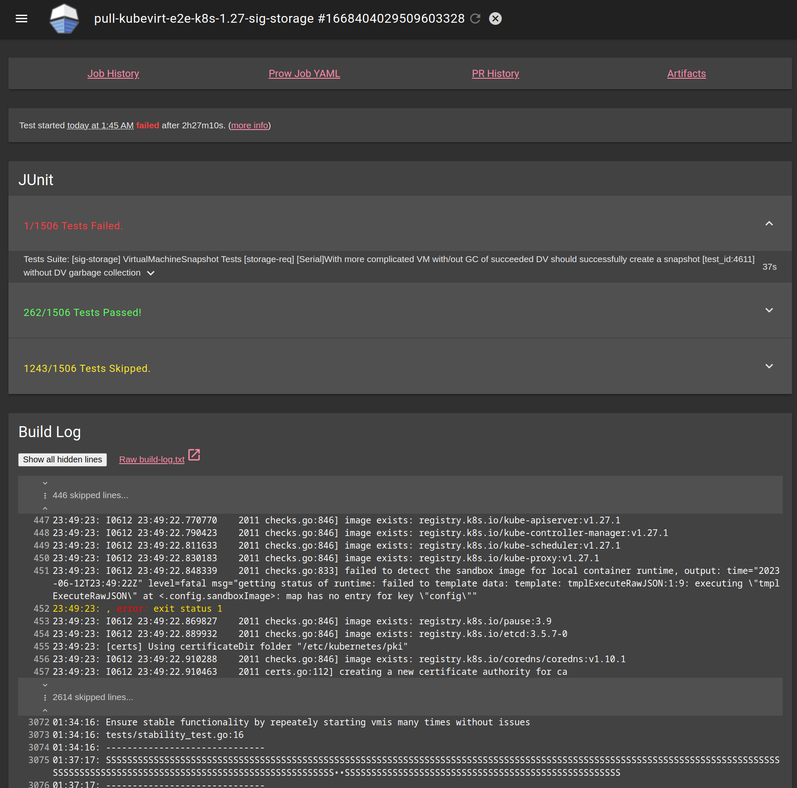
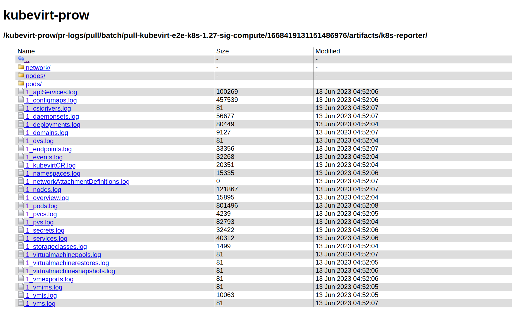

# KubeVirt Prow

[KubeVirt Prow] is the dedicated [Prow](https://docs.prow.k8s.io/docs/overview/) instance for the KubeVirt organization.

[KubeVirt Prow] is the entry page for several prow components, like [Tide](https://docs.prow.k8s.io/docs/components/core/tide/), which takes care of automated merging of PRs (if configured for a repository).

It holds the documentation of all the installed plugins that are available.

It also runs the automation for the KubeVirt organization and automates merging of pull requests using Tide.

See also: https://github.com/kubevirt/community/tree/main/docs

## Prow and Prow Jobs

Prow runs all our test job configurations for the projects, i.e. when a PR on kubevirt/kubevirt is created or updated, [presubmit jobs configured here](https://github.com/kubevirt/project-infra/blob/main/github/ci/prow-deploy/files/jobs/kubevirt/kubevirt/kubevirt-presubmits.yaml) are run. It also runs periodics (i.e. daily jobs) and postsubmits.
All Prow job configurations are hosted on [kubevirt/project-infra](https://github.com/kubevirt/project-infra). See [docs for job configuration](https://docs.prow.k8s.io/docs/jobs/).

This is the entry page provided by [Deck](https://docs.prow.k8s.io/docs/components/core/deck/) where you have an overview of all job runs on the Prow instance. From here you can filter on various criteria to select the jobs that you need to have a look at

## Prow Job types

| Type | When run                                                                                              |
| ---- |-------------------------------------------------------------------------------------------------------|
| presubmit | after a commit is pushed to a pull request                                                            |
| postsubmit | after a pull request is merged to a branch                                                            |
| batch | whenever a batch run is initiated by Tide to test several pull requests before merge at the same time |
| periodic | on a defined interval                                                                                 |

## Logs and Artifacts on job details page

After you click on a job link in the prow status page you are taken to the job run overview page that, when finished, contains information about tests (if available), the log file (normally showing the relevant portion to highlight where it failed), and links to details (i.e. full log (see at the bottom)

At the top of the page you see links to other detail sections:
* job history - shows you the history of all job runs on a presubmit job for a specific lane.
* PR history - shows you all test job runs in a grid. Column headers are the commit ids that have the jobs been run on. Row headers are the job names.
* artifacts - shows a browseable list of all files that have been captured for this test run. You can drill down here into the folder.

For jobs that have finished (either failed or succeeded) you can get further job information at the bottom of the page.

### Artifacts captured by k8s reporter

Each file in the artifacts folder has a numerical prefix. In this case we only see files prefixed with  1_. All files with the same numerical prefix belong to a specific test failure. Since only one test failed on this lane, only one prefix exists.The log files only  contain logs, yaml or events which happened during the runtime of this specific job. This is a big difference to must-gather which just dumps everything it sees (e.g. full log history), which is not suitable for debugging flaky tests.

**If you don't know where to start looking, open the `overview.log`, then go to the `events.log`.**

See also:
* [KubeVirt Prow - periodic jobs](https://prow.ci.kubevirt.io?type=periodic&state=failure)
