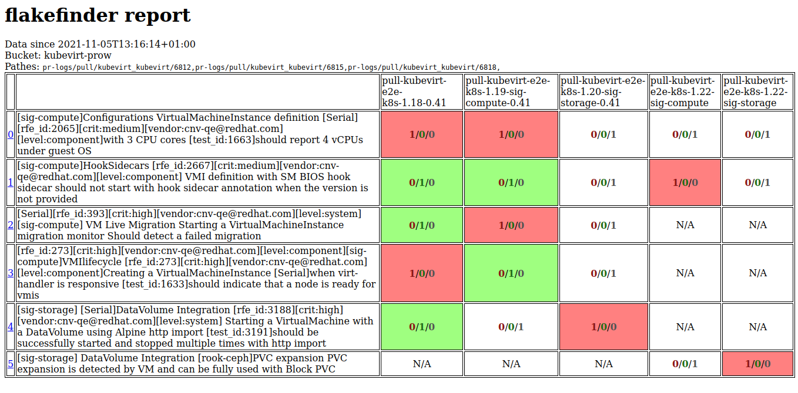
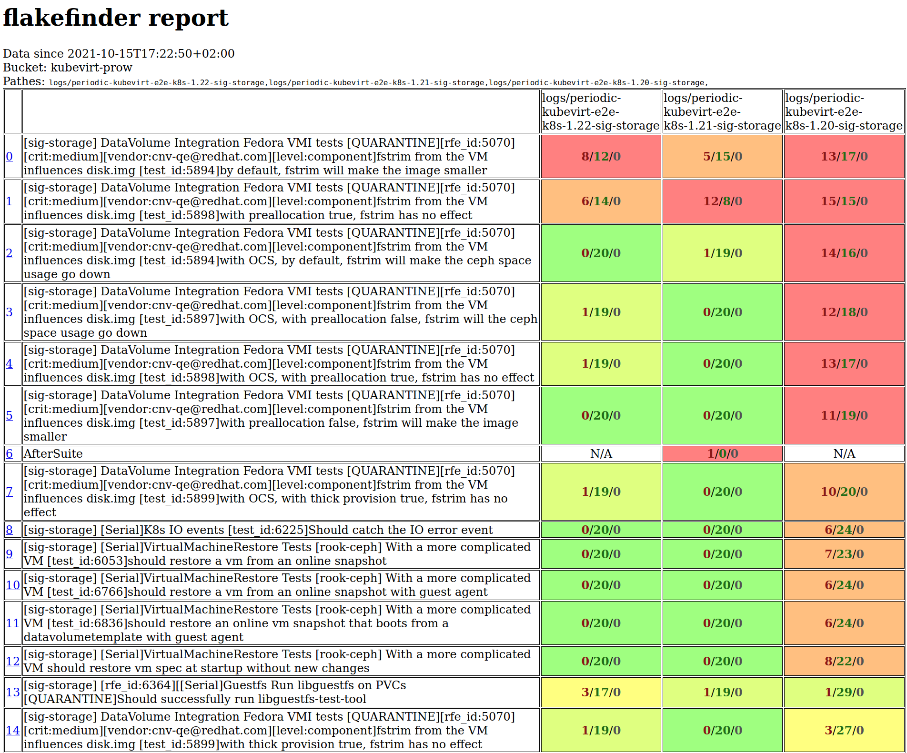

flake-report-creator
====================

aims to use the flakefinder logic of creating reports for a set of GCS job directories, whereas it just fetches all subdirectories, tries to find junit files and returns a report of the aggregated data. In general we can  generate a matrix of flakiness over several runs of several jobs.

This tool enables a user to create an ad-hoc report of any GCS directories that contain kubevirt testing junit files, in turn enabling a report over unrelated or just selected PRs, or a selected set of periodic jobs. The user needs to make sure whether that makes sense of course 😏

**Note: job results older than two weeks are skipped by default. Use `--start-from` argument to extend the range to older results**

Usage
-----

**Example 1:** we want to create a report from job runs of two PRs on openshift-ci.  But we want to skip all jobs that don't match a certain regular expression.

*NB1: we use `start-from` here as some test results would have been skipped, as this was a quite long running PR*
*NB2: we use `sub-dir-regex` here to filter out other unimportant jobs (openshift-ci related validation checks i.e)*

```bash
$ bazel run //robots/cmd/flake-report-creator -- --ci-system=openshift --presubmits 22352,23021

...
2021/10/29 12:57:54 main.go:216: writing output file to /tmp/flakefinder-3764038013.html
```

Result: 

**Example 2:** we want to create a report over a set of selected pull requests for kubevirtci,
but we only want to see the e2e jobs.

The default values will create a report for the last 14 days.

```bash
$ bazel run //robots/cmd/flake-report-creator -- --ci-system=kubevirt --presubmits 6812,6815,6818
...
2021/10/29 17:24:49 main.go:242: writing output file to /tmp/flakefinder-3053258374.html
```

Result: 

**Example 3:** we want to create a report over a set of periodics on openshift-ci.

The default values will create a report for the last 14 days.

```bash
$ bazel run //robots/cmd/flake-report-creator -- --ci-system=openshift --periodics 0.34,0.36,0.41,4.10
...
2021/10/29 16:39:54 main.go:241: writing output file to /tmp/flakefinder-1095073378.html
```

Result: 

**Example 4:** we want to create a report over a set of selected periodics for kubevirtci.

The default values will create a report for the last 14 days.

```bash
$ bazel run //robots/cmd/flake-report-creator -- --ci-system=kubevirt --periodics 1.21,1.22

...
INFO[0118] Skipping test results before 2021-10-15 17:22:50.286379347 +0200 CEST m=-1209599.993786708 for logs/periodic-kubevirt-e2e-k8s-1.20-sig-storage/1449002154302902272 in bucket 'kubevirt-prow' 
2021/10/29 17:24:49 main.go:242: writing output file to /tmp/flakefinder-3053258374.html
```

Result: 
