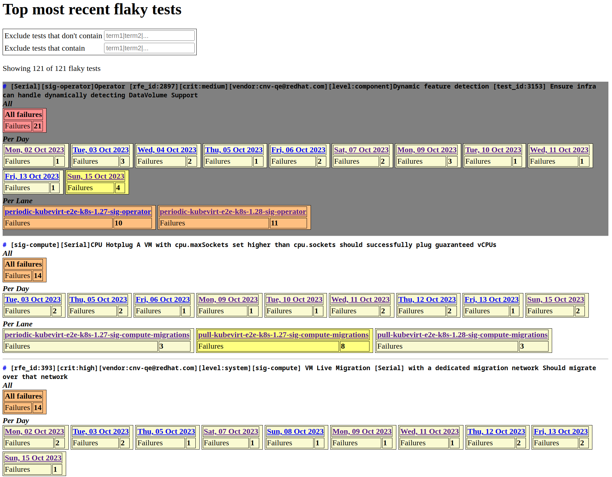

# flake-stats

`flake-stats` is a go tool that aggregates the flakefinder stats for a given time frame set with `days-in-the-past` and then generates an html page from the aggregates. Goal is to have a more condensed picture of where flakes are impacting us the most. Thus the aggregate values are colored as a heat map, where depending on their share of all failures, the redder the card is.

The html file has two sections, the overall aggregates and the per test aggregates.

# Overall aggregates

Overall aggregates section shows the total test failures for the time frame. It shows the totals overall, totals per day and totals per lane for the given time frame.

# Per test aggregates

Per test aggregates section shows the test failures for all tests that had failures in PR runs during the time frame. The tests are sorted by share descending, thus the highest overall impacting tests appear first.

It shows the totals overall, totals per day and totals per lane. At the top of the section below the header there are two filter fields that adjust which tests are shown.

If any test has been seen in QUARANTINE, the given aggregates will have a grey background.

